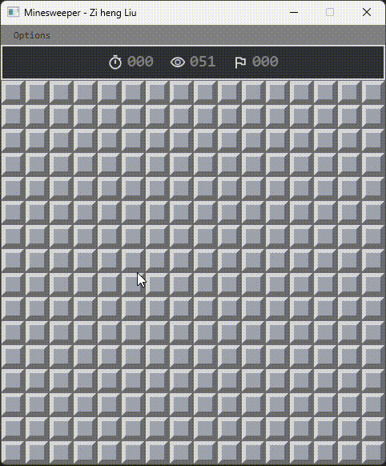

# MINESWEEPER

A robust, enterprise-architected clone of the classic Minesweeper game, built using modern Java and JavaFX.
Created as one of the two projects I chose to work on during a short blitz to expand my portfolio and challenge
myself in applying the totality of what I've learned to date.

## 🛠️ Tech Stack

* **Language:** Java 21
* **UI Framework:** JavaFX
* **Build Tool:** Apache Maven
* **Core Concepts:** MVC Architecture, Command Pattern, Observer Pattern, Recursion.

## 🚀 Key Architectural Features

* **Algorithmic User Experience:** Designed a deferred, parameter-driven matrix generation algorithm that computes mine placements relative to the user's initial input, guaranteeing a safe first interaction.

* **Optimized Presentation Layer:** Despite the fact that it could run on a toaster, I committed to designing a highly efficient UI using a granular 1:1 Observer pattern. Logical mutations trigger isolated, single-cell UI updates rather than costly full-grid re-renders, ensuring smooth performance even on the Expert difficulty (16x30 grid).

* **Dynamic UI Regeneration:** Leveraged the Command pattern to seamlessly manage game state transitions. The interface and matrix dynamically regenerate and resize on the fly to support varying difficulty dimensions (Beginner, Intermediate, Expert).

* **Efficient Matrix Traversal:** Implemented a recursive flood-fill algorithm that fluidly unveils safe zones and navigates complex 2D matrix structures.

* **Strict Decoupling:** Complete separation of the core game logic from the rendering layer through functional interfaces and event handling.

 

  
  
  
  

## 🎮 How to Run (Pre-compiled Release)

> **IMPORTANT**: You must have **Java 21** (or higher) installed on your machine to run this application.
> [**The latest version of Java Temurin can be found here.**](https://adoptium.net/temurin/releases)

1. Navigate to the [Releases](../../releases) page of this repository.
2. Download the latest `Minesweeper-v1.0.jar` file.
3. Run the .jar file and enjoy! :)